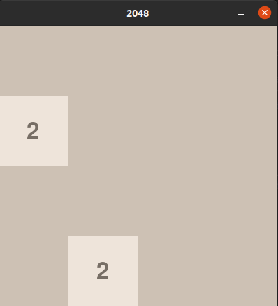

### Jogo 2048 com Pygame

2048 é um jogo de raciocínio e lógica onde o jogador desliza blocos de números em uma grade 4x4 para combinar números iguais e formar novos blocos com valores maiores. O objetivo é alcançar o bloco de valor **2048**. O jogo termina quando não há mais movimentos possíveis, ou, o jogador alcançou o bloco de valor **2048**.

A cada movimento do jogador, um novo bloco com o valor **2** ou **4** aparece em uma posição aleatória da grade. Os blocos se movem para a direção escolhida (cima, baixo, esquerda ou direita), combinando valores iguais. A pontuação aumenta a cada combinação de números iguais, gerando o seu múltiplo.

| 💡 **Dica:** |
|--------------|
| Se quiser testar o jogo, com uma busca no Google você consegue achar vários sites que disponibilizam o jogo gratuitamente. [Um deles é esse aqui](https://2048game.com/pt/). |

#### **Descrição do Projeto**
Você deve criar uma versão funcional do jogo **2048** utilizando a biblioteca **Pygame**. O jogo deve incluir:
- Uma interface gráfica com a grade de 4x4. (Esta parte foi implementada como um presente para vocês <3)
- Blocos que deslizam e se combinam com base nas entradas do jogador.
- Um sistema que verifica condições de vitória ou derrota.

### **Rubricas de Avaliação**

A pontuação total será **10 pontos**, distribuída em diferentes níveis de desenvolvimento.

#### Mecânica do Jogo (3 pontos)  

**Missões**:
- Implementar o movimento dos blocos para **cima**, **baixo**, **esquerda** e **direita**.
- Garantir que os blocos parem nas bordas ou ao encontrar outro bloco.
- Blocos de mesmo valor se combinam corretamente ao colidirem.

**Critérios de avaliação**:
- Movimentos respondem corretamente às teclas pressionadas.
- Combinações aumentam o valor do bloco corretamente.
- Novos blocos aparecem após cada movimento.

#### Interface Gráfica e Feedback Visual (2 pontos)

**Missões**:

- Implementar uma pontuação que aumenta a cada combinação correta.
- A pontuação é exibida corretamente na interface do jogo.
- Adicionar as cores correspondentes para todos os blocos possíveis na interface gráfica do jogo, abrangendo os valores: **2**, **4**, **8**, **16**, **32**, **64**, **128**, **256**, **512**, **1024** e **2048**.

### Lista de cores sugeridas para cada bloco:
- **2**: Bege claro  
- **4**: Bege escuro  
- **8**: Laranja suave  
- **16**: Laranja médio  
- **32**: Laranja intenso  
- **64**: Vermelho-laranja  
- **128**: Amarelo dourado  
- **256**: Amarelo moderado  
- **512**: Amarelo profundo  
- **1024**: Amarelo muito intenso  
- **2048**: Dourado vibrante

Sinta-se a vontade para usar outras cores se quiser, mas garanta que cada bloco tenha uma cor única.

#### Condições de Jogo (2 pontos)

**Missões**:
- Tratar corretamente as condições de **fim de jogo**.
- Implementar uma mensagem indicando vitória (quando o jogador alcança 2048) ou derrota.
- Permitir reiniciar o jogo sem fechar o programa.

**Critérios de avaliação**:
- O jogo detecta corretamente quando não há mais movimentos.
- Mensagens de vitória ou derrota aparecem adequadamente.

#### Extras e Melhorias (3 ponto)**  

**Missões**:
- Adicionar animações para os movimentos e combinações de blocos.
- Permitir que o jogador continue após alcançar 2048.
- Personalizar o jogo com sons, fontes diferentes ou design criativo.

**Critérios de avaliação**:
- As animações e/ou sons enriquecem a experiência do usuário.
- Funcionalidades adicionais são implementadas corretamente.

### **Entrega**
O projeto deve ser enviado via GitHub Classroom, com:

1. O código-fonte completo comentado.
2. Um arquivo `README.md` explicando como rodar o jogo e descrever brevemente as funcionalidades implementadas.
3. Um vídeo curto mostrando o jogo em execução (pode ser um link do youtube).
